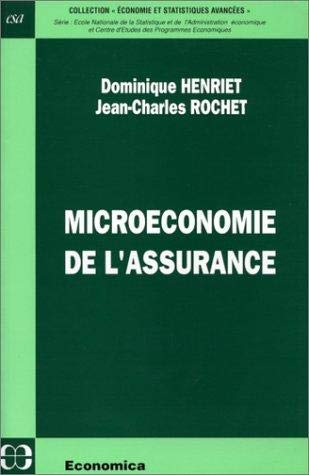

No single book covers the whole course. The list below is deliberately short: each title is particularly useful for one or more chapters, and together they provide a good route through most of the material.

::: {.book-grid}

::: {.book}
[{fig-alt="Cover of Mathématiques de l'assurance non-vie, volume I"}](https://www.fnac.com/a1554472/Michel-Denuit-Mathematiques-de-l-assurance-non-vie)
[Mathématiques de l'assurance non-vie, I]{.title}
[Michel Denuit and Arthur Charpentier Economica, 2004]{.meta}
:::

::: {.book}
[{fig-alt="Cover of Mathématiques de l'assurance non-vie, volume II"}](https://www.fnac.com/a1574462/Michel-Denuit-Mathematiques-de-l-assurance-non-vie)
[Mathématiques de l'assurance non-vie, II]{.title}
[Michel Denuit and Arthur Charpentier Economica, 2005]{.meta}
:::

::: {.book}
[{fig-alt="Cover of Microéconomie de l'assurance"}](https://www.amazon.fr/Micro%C3%A9conomie-lassurance-Dominique-Henriet/dp/2717820191/)
[Microéconomie de l'assurance]{.title}
[Dominique Henriet and Jean-Charles Rochet Economica, 1999]{.meta}
:::

::: {.book}
[{fig-alt="Cover of Risk Theory and Reinsurance"}](https://link.springer.com/book/10.1007/978-1-4471-5568-3)
[Risk Theory and Reinsurance]{.title}
[Griselda Deelstra and Guillaume Plantin Springer, 2014]{.meta}
:::

::: {.book}
[{fig-alt="Cover of Economic and Financial Decisions under Risk"}](https://press.princeton.edu/books/paperback/9780691122151/economic-and-financial-decisions-under-risk)
[Economic and Financial Decisions under Risk]{.title}
[Louis Eeckhoudt, Christian Gollier and Harris Schlesinger Princeton University Press, 2005]{.meta}
:::

::: {.book}
[{fig-alt="Cover of World Insurance: The Evolution of a Global Risk Network"}](https://global.oup.com/academic/product/world-insurance-9780199657964)
[World Insurance]{.title}
[Peter Borscheid and Niels Viggo Haueter, eds. Oxford University Press, 2012]{.meta}
:::

:::

## Notes on the list

**Denuit and Charpentier** is the main reference for Chapters 3 to 6 of the course. Volume I, *Principes fondamentaux de théorie du risque*, covers premium principles, risk measures, stochastic orderings and dependence; Volume II, *Tarification et provisionnement*, covers generalised linear models, credibility, bonus–malus systems and reserving. The books are written in French and assume little beyond a solid grounding in probability, making them unusually approachable introductions to a technical literature.

**Henriet and Rochet** is the main reference for Chapter 2. It is short and precise, covering the supply of and demand for insurance, equilibrium under complete information, and then adverse selection and moral hazard. If you read one book alongside the lectures on contract design, make it this one.

**Deelstra and Plantin** is a concise volume covering premium calculation principles and the institutional reality of the reinsurance market. It is the English-language complement to Chapters 3 and 5 and is particularly useful because it does not separate the mathematics from the market it describes.

**Eeckhoudt, Gollier and Schlesinger** is a standard modern treatment of decision-making under risk. Read it for the foundations of Chapter 2, and because it connects insurance with the broader field of financial economics.

**Borscheid and Haueter** is an edited history of the global insurance industry from the late eighteenth century onwards, with chapters devoted to a wide range of countries. It provides useful background reading for Chapter 1. It is a long book, and you are certainly not expected to read it from cover to cover.